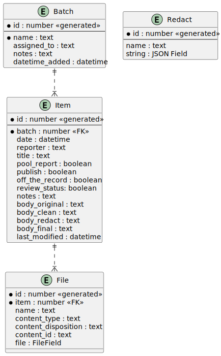

# scutes

Item Processing Application for WHCA Pool Reports Collection

## Development Environment

See [docs/DevelopmentEnvironment.md](docs/DevelopmentEnvironment.md).

## Database Schema



## Load Test Data

In src directory, load test data by running:

```zsh
./manage.py loaddata test_data
./manage.py runserver
```
